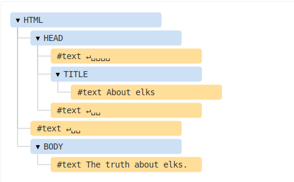

# Element & Nodes

## Element

Un élément représente toute les Balises HTML ou tous autre éléments dans un DOM (Document Object Modèle).

## Nodes

Un nodes représente tous ce qu'il y a dans un DOM ( redirection vers "défition_de_nodes.js" pour plus d'informations sur les Noeux ).

### Général Informations

On peut utiliser un Nodes pour sélectionner un élément, mais un élément est un #NodesElements !

Les nodes & Element peuvent avoir des liasons avec leur type égaux (nodes / element) proche ou éloigner (redirection vers "liaison_familiale.js" pour plus d'informations sur les Liaisons).

# __*Présentation des différence entre Element & Nodes*__

* Element = Blue
* Nodes = La totalité

